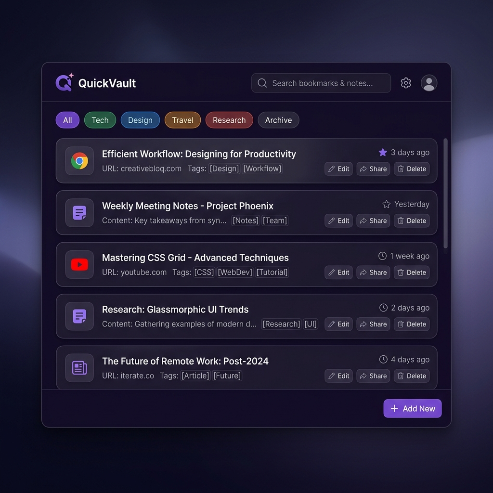

<p align="center">
  
</p>

<h1 align="center">QuickVault</h1>

<p align="center">
  <strong>Ultra-fast bookmark & notes overlay for your PC</strong><br>
  <em>Press <code>Ctrl+Shift+Space</code> anywhere — save links and notes in under 3 seconds</em>
</p>

<p align="center">
  
  
  
  
  
</p>

---

## ✨ What is QuickVault?

QuickVault is a **keyboard-first, floating overlay** that lets you instantly save bookmarks and notes from **anywhere on your PC** — without switching apps, opening browsers, or losing focus.

**The problem:** You find a useful link or have a quick thought. You open a note app, wait for it to load, navigate to the right page, type, and save. By the time you're done, 30 seconds have passed and you've lost your flow.

**QuickVault's answer:** Press 3 keys → type → Enter. Done. **~3 seconds.** Then it disappears.

---

## 🚀 Features

### Core
| Feature | Description |
|---|---|
| ⌨️ **Global Hotkey** | `Ctrl+Shift+Space` works from anywhere — browser, VS Code, games, fullscreen apps |
| ⚡ **Instant Capture** | Paste a URL → auto-fetches title. Type text → saved as note |
| 🔍 **Fuzzy Search** | Smart search powered by Fuse.js across all your items |
| 🏷️ **Tags** | Add `#work`, `#research`, `#personal` inline — auto-extracted |
| 📌 **Pin to Top** | Pin frequently used items for instant access |
| ✏️ **Edit Notes** | Click edit button to modify any saved item |
| ↩️ **Undo Delete** | 5-second undo toast after deleting an item |

### Organization & Views
| Feature | Description |
|---|---|
| 📊 **Dashboard** | Stats overview — item counts, top tags, most visited links, recent items |
| 🌙 **Dark / Light Mode** | Toggle themes with one click, persisted across sessions |
| 📐 **Compact / Expanded** | Switch between detailed and minimal card views |

### Security & Data
| Feature | Description |
|---|---|
| 🔒 **AES-256 Encryption** | Encrypt sensitive notes with a password (never stored on disk) |
| 💾 **100% Offline** | SQLite database — your data never leaves your machine |
| 📤 **Export** | Markdown, JSON, or HTML — your data, your format |

### Quality of Life
| Feature | Description |
|---|---|
| 📝 **Multi-line Notes** | `Shift+Enter` for new lines in the input |
| 🖥️ **Multi-Monitor** | Opens on the monitor where your cursor is |
| 🔔 **Hotkey Conflict Alert** | Notifies you if another app already uses the shortcut |
| 🔄 **Auto-Start** | Starts with Windows when installed (packaged builds) |

---

## 📸 Screenshots

<table>
<tr>
<td align="center"><strong>Dark Mode</strong></td>
<td align="center"><strong>Light Mode</strong></td>
</tr>
<tr>
<td></td>
<td></td>
</tr>
</table>

---

## ⚡ Quick Start

### Prerequisites
- [Node.js](https://nodejs.org/) v18+ installed
- Windows 10/11

### Install & Run

```bash
# Clone the repo
git clone https://github.com/YOUR_USERNAME/quickvault.git
cd quickvault

# Install dependencies
npm install

# Rebuild native modules for Electron
npx electron-rebuild

# Launch the app
npm start
```

### Build Portable .exe

```bash
npm run build
# Output: dist/QuickVault-Portable.exe
```

---

## ⌨️ Keyboard Shortcuts

| Key | Action |
|---|---|
| `Ctrl+Shift+Space` | Toggle overlay from anywhere |
| `Enter` | Save current input |
| `Shift+Enter` | New line in note |
| `Esc` | Hide overlay / close modals |
| `↑` / `↓` | Navigate between items |
| `Tab` | Move between UI elements |

---

## 🗂️ Project Structure

```
quickvault/
├── src/
│   ├── main.js          # Electron main process — window, tray, hotkey, IPC
│   ├── database.js      # SQLite layer — CRUD, encryption, export, stats
│   ├── preload.js       # Secure IPC bridge (contextIsolation)
│   └── renderer/
│       ├── index.html   # UI markup
│       ├── app.js       # All frontend logic
│       └── styles.css   # Dark/light themes, glassmorphism
├── assets/
│   └── icon.png         # App icon
├── package.json
├── LICENSE
└── README.md
```

---

## 🛠️ Tech Stack

| Component | Technology |
|---|---|
| **Framework** | Electron 35 |
| **Database** | SQLite (better-sqlite3) with WAL mode |
| **Search** | Fuse.js (fuzzy matching) |
| **Encryption** | AES-256-GCM (Node.js crypto) |
| **Styling** | Vanilla CSS with CSS Variables |
| **Font** | Inter (Google Fonts) |

---

## 📊 Performance

| Metric | Value |
|---|---|
| **RAM (idle in tray)** | ~50 MB |
| **RAM (window open)** | ~130 MB |
| **Startup time** | < 2 seconds |
| **Window appear time** | < 200ms |
| **Portable .exe size** | ~78 MB |
| **Source code** | ~60 KB (6 files) |

---

## 💾 Data Storage

- **Location:** `%AppData%/quickvault/quickvault.db`
- **Format:** SQLite database
- **Backup:** Copy the `.db` file
- **Migration:** Old JSON data auto-migrated on first run

---

## 🔒 Security

- **Context Isolation** — renderer cannot access Node.js APIs directly
- **No `nodeIntegration`** — follows Electron security best practices
- **AES-256-GCM** — military-grade encryption for sensitive notes
- **Password never stored** — if lost, encrypted notes are unrecoverable
- **URL validation** — only `http://` and `https://` URLs are opened externally

---

## 🗺️ Roadmap

- [ ] Customizable global hotkey
- [ ] Browser extension (Chrome/Edge)
- [ ] Clipboard watcher (auto-detect copied URLs)
- [ ] Favicon for links
- [ ] Import browser bookmarks
- [ ] Cloud sync (opt-in)
- [ ] Mobile companion (PWA)

---

## 🤝 Contributing

1. Fork the repository
2. Create your feature branch (`git checkout -b feature/amazing-feature`)
3. Commit your changes (`git commit -m 'Add amazing feature'`)
4. Push to the branch (`git push origin feature/amazing-feature`)
5. Open a Pull Request

---

## 📄 License

This project is licensed under the MIT License — see the [LICENSE](LICENSE) file for details.

---

<p align="center">
  Built with ❤️ using Electron • SQLite • Fuse.js
</p>
